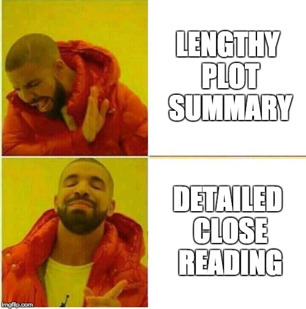

{#id .class width=250 height=250px}\

# Openings

## One

Parable of the Sower is a science fiction dystopian novel written by Octavia E. Butler and published in 1993. The story is set in the 2020's in a society which has lost all order and is largely broken down due to climate change and increased government capitalism. The story is narrated from the perspective of a young 15-year-old woman named Lauren Olamina. Lauren is a young black teen who grew up in a broken-down community near southern Los Angeles. Due to her Prenatal alcohol exposure as a result of her mother's carelessness, she develops a condition known as Hyperempathy syndrome, which causes her to feel the same sensations that she witnesses others experiencing, whether it be pain or pleasure. This causes her to be more compassionate, but at the same time, more vulnerable to others, as others can hurt her by hurting themselves. In 2024, Lauren gets baptized, despite her not believing in her father's religion. After hearing about an astronaut dying on Mars, the newly inspired Lauren decides to create her own religion, coining it Earthseed. As time moves on, society begins to devolve around her due to extreme worldwide poverty and government capitalism, and all forms of social structure and order collapse. [...]

## Two

Science fiction has always evoked many common themes and idea, mainly thoughts of the future and how society may change. As the genre of science fiction grew through the decades, the themes introduced shifted from an optimistic and fantastical point of view to a more grounded and often grim view of what the future may hold. Stories such as Stanley G. Weinbaum's "A Martian Odyssey" depicts the fantastical world of Mars and a human's adventures on the planet, and represents the early and happy beginnings of the genre in the 1930's. As the 1940's approach, the stories focus less on the fantasy and more on the issues associated with them, as in Robert Heinlein's "The Roads Must Roll". In the later 1940's, this change is taken one step further, as the stories become very realistic and extremely grim, such as Theodore Sturgeon's "Thunder and Roses."

## Three

Science fiction stories and historical novels "denaturalize the present by showing it to be neither arbitrary nor inevitable but the conjunctural result of complex, knowable" processes (Freedman 56). Lavie Tidhar's *Central Station* explores this theme and concept in detail. While the past and present presented in the setting of *Central Station* are not the same as the real world echoes of our world are present and the reader can connect the fictional world presented to the real world. The future Tel Aviv shown has many of the same characteristics as the real Tel aviv, but with a science fiction twist. Lavie Tidhar's *Central Station* could be considered a historical novel by this definition. Both science fiction and the historical novel reveal to the reader their relationship to the events of history, and their place and role in the present.

# Close Reading

## One

Back in the 1930's, stories like Hamilton's "The Man Who Evolved" were around. This story outlines how a mad scientist solves the mystery of how evolution works, and he proceeds to evolve himself 50 million years at a time. As he progresses, his physical form begins to take shape into more and more of an intellectually-superior being. This leads to our mad scientist becoming nothing more than a brain that sits on the floor of a cosmic-ray-radiating tube. Finally, he evolves one more time into protoplasm. Afterwards, his two colleagues burn down the country home, one gets admitted to a psych-ward, and one never tells anyone of what he had seen.

I believe this story, first off, adds the science fiction aspect into a world that seems very 1930's-esque. It all came in the little details such as how Pollard---the mad scientist---lives in an isolated cottage in the countryside. Perhaps it was just the Frankenstein-like vibes I got from that sentence, but it really made the story feel dark and mysterious from the very beginning. I appreciated this mysterious aspect of the story as well as later into the text because the entire goal of Pollard was to answer some of the world's unanswered questions. He intended to create the evolution chamber with intentions to find what caused evolution and to find what the future had in store for human evolution.

## Two

Following a time of moral imparting allegories, stories transformed to instead share ideas and directly debate imagined future situations that were quickly becoming a new reality. The 1941 short story *Reason* by Isaac Asimov showed humanity how robots may one day approach knowledge with artificial intelligence. At the beginning of the story, Powell awakens a robot named Cutie saying, "Donovan and I put you together with parts shipped to us" (Asimov, 34). Cutie is unhappy with this explanation, so Powell and Donovan show him the observation room where they aim energy lasers and tell him about the vastness of outer space. Asimov uses science to show the reader that a future with new technology including these laser ships. Upon hearing this Cutie declares, "Globes of energy millions of miles across! Worlds with five billion humans on them! Infinite emptiness! Sorry Powell, I just don't believe it. I'll puzzle this thing out for myself. Good-bye," (Asimov, 35) and everyone angrily goes back to work. A few Days later the ship is approaching a storm and Cutie comes to talk with Powell. During this conversation, Cutie says, "The material you are made of is soft and flabby, lacking endurance and strength, depending upon insufficient oxidation of material. Periodically you pass into a coma and the least variation of temperature, air pressure, humidity, or radiation intensity impairs you efficiently. You are makeshift" (Asimov, 36). In the 1940s people were concerned that robots would decide that humans are inadequate. This extrapolation on the first artificial intelligences revealed that if robots had no feelings, they would not care for humans. In Asimov's story, Cutie goes on to say, "I on the other hand am a finished product," (Asimov, 36) and listing how he is efficient, strong, and robust. The conclusion Cutie draws from these ideas is that "no being can create another being superior to itself," *(Asimov, 37). This conclusion, although flawed, is the basis that Cutie assumes to be true which creates catastrophes in the next logical deductions. With only simple induction from mathematical reasoning Cutie decides that he does not need the humans any longer and locks them in a room. After Cutie successfully takes care of an electron storm, Powell decides that because the robots are achieving their purpose of running the space station, that it does not matter what the robots believe. This story shows that arguments with robots, especially ones who think they are an improvement on humanity, cannot be won. The certainty that Cutie reasons with in the story makes it hard for Powell to dispute any wrong argument. In the 1940s, Robots and Artificial Intelligence were highly debated and theorized, changing science fiction stories to prediction about the future based on different choices in the present.

## Three

Delany's inimitable style becomes apparent from the first paragraph, where the novel's protagonist, Bron Helstrom, walks home from work. In the opening, Delany writes, "So, at four o'clock, as he strolled from the hegemony lobby [...]." The term "hegemony" connotes dominance. By naming a public landmark "the hegemony lobby", Delany attaches to Tethys society a sense of tightly controlled unity. Here, Delany's usage of vocabulary subtly suggests Tethys as an uncomfortable place for outsiders, making the later revelation of Bron's dissatisfaction with life in a seemingly utopian society more believable. The sentence proceeds with a lengthy parenthetical statement. Parentheses typically contain non-essential information. By using parentheses, Delany implies that, for the characters, the enclosed information does not need mentioning. For readers, however, this means that words in parentheses describe scenarios ingrained into the everyday lives of characters, and therefore play an important in role in establishing the setting. In this paragraph, the parenthetical statement hints at the calendar system on Tethys, which clearly differs significantly from our own. Subscripts commonly show up in mathematic and scientific expressions. Therefore, the usage of a subscript in the term "second year~N~" imbues Tethys society with a sense of sophistication. The more important information, however, comes with the disclosure that Earth and Mars still use the familiar calendar system. Here, before even mentioning conflict between the satellites and inner planets, Delany establishes that Tethys culture runs counter to other cultures in the solar system. By emphasizing the differences between societies, Delany makes the interplanetary war feel more natural to the setting.

\newpage

# detach and return

For my next paper, I would like to improve on the following…

***********
